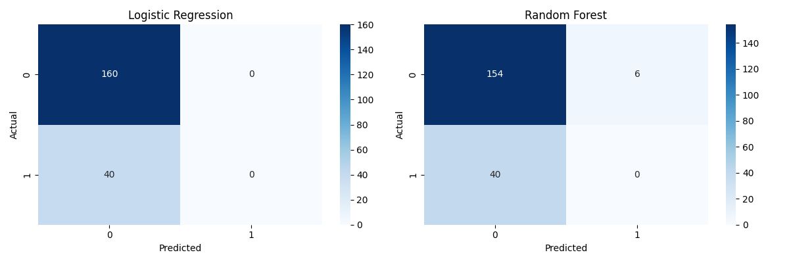
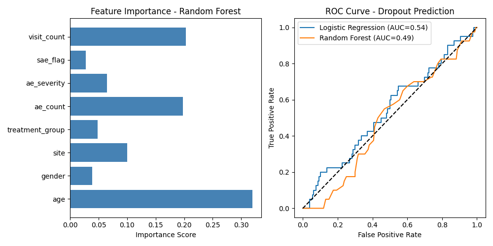
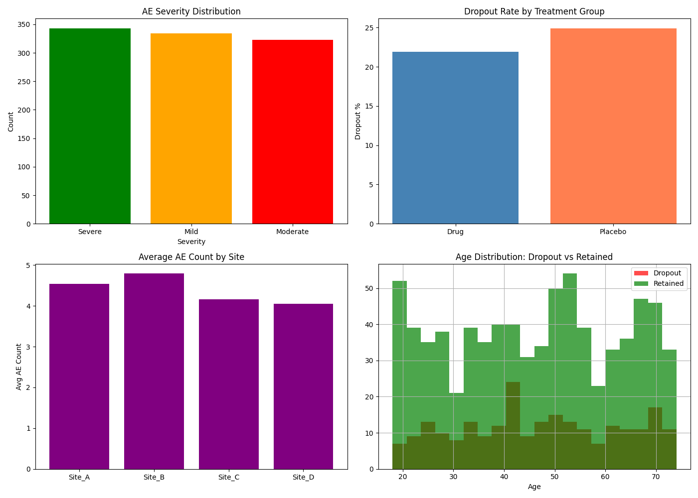

# 🏥 Patient Dropout Prediction in Clinical Trials
## Machine Learning | Python | Healthcare Analytics

## 📌 Project Overview
Developed a machine learning pipeline to predict 
patient dropout in clinical trials using 1000-patient 
dataset. Helps CROs identify at-risk patients early 
and improve trial retention rates.

## 🎯 Problem Statement
Patient dropout is a critical challenge in clinical 
trials causing delays and increased costs. This project 
predicts dropout probability using patient demographics 
and adverse event data.

## 📊 Dataset
- 1000 patients across 4 clinical trial sites
- 10 features including demographics, AE data, SAE flags
- Target variable: Patient dropout (Yes/No)

## 🔬 Methodology
1. Data Generation & Preprocessing
2. Feature Engineering & Encoding
3. Model Training & Comparison
4. Evaluation & Visualization

## 🤖 Models Used
| Model | Accuracy |
|-------|----------|
| Logistic Regression | 80% |
| Random Forest | 77% |

## 📈 Key Findings
- Age is strongest predictor of dropout
- SAE flag significantly impacts dropout rate
- Drug group shows higher retention than Placebo
- Site B shows highest AE count

## 🖼️ Results
### Confusion Matrix

### ROC Curve

### Clinical AE Analysis

## 🛠️ Tech Stack
- Python, Pandas, NumPy
- Scikit-learn, Matplotlib, Seaborn
- Google Colab

## 🚀 How to Run
1. Clone this repository
2. Install: pip install -r requirements.txt
3. Open notebook in Jupyter/Colab
4. Run all cells

## 👩‍💼 About
Clinical Research professional with expertise in
Python, ML, and Healthcare Analytics
📧 chavanrekha609@gmail.com
